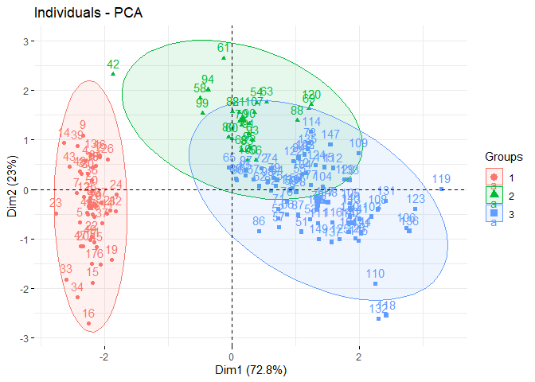

<!-- README.md is generated from README.Rmd. Please edit that file -->

# hclusteasy <a href="https://github.com/tsukubai/hclusteasy"></a>

<!-- badges: start -->

[](https://lifecycle.r-lib.org/articles/stages.html#experimental)
[](https://CRAN.R-project.org/package=hclusteasy)
<!-- badges: end -->

## Overview

The hclusteasy package aims to simplify hierarchical clustering analysis
by integrating essential functions from renowned R packages. It enables
reading data in txt, xlsx, and xls formats using utils and readxl,
offers advanced data normalization techniques from the clusterSim
package, performs hierarchical clustering (HCA) with the stats package,
and conducts principal component analysis (PCA), plotting the first two
components using stats and factoextra.

### Documentation References

- **utils**: Documentation available in RStudio with `?utils`
- **readxl**: Documentation on
  [CRAN](https://cran.r-project.org/package=readxl) and
  [GitHub](https://github.com/tidyverse/readxl)
- **clusterSim**: Documentation on
  [CRAN](https://cran.r-project.org/package=clusterSim)
- **stats**: Documentation available in RStudio with `?stats`
- **factoextra**: Documentation on
  [CRAN](https://cran.r-project.org/package=factoextra) and
  [GitHub](https://github.com/kassambara/factoextra/tree/master)

## Installation

You can install hclusteasy from GitHub using the `devtools` package.:

``` r
# Install devtools if you haven't already
if (!requireNamespace("devtools", quietly = TRUE)) {
  install.packages("devtools")
}

# Install the package directly from GitHub
devtools::install_github("tsukubai/hclusteasy")
```

## Introduction

hclusteasy is designed to streamline the process of hierarchical
clustering analysis by integrating several useful functions from popular
R packages. The main goal of this package is to provide an easy-to-use
interface for reading data, normalizing it, performing hierarchical
clustering, and visualizing the results through PCA.

### Datasets

| Dataset    | Description                                                                                                                                                                                                                                                                                                                                                                                                                                                                          |
|------------|--------------------------------------------------------------------------------------------------------------------------------------------------------------------------------------------------------------------------------------------------------------------------------------------------------------------------------------------------------------------------------------------------------------------------------------------------------------------------------------|
| *iris_uci* | The Iris dataset is a classic dataset used for analysis and machine learning, containing 150 samples of iris flowers from three different species: Iris setosa, Iris versicolor, and Iris virginica. Each sample has four morphological features: sepal length, sepal width, petal length, and petal width, measured in centimeters. Created by Ronald A. Fisher in 1936, the dataset is often used for testing classification algorithms.                                           |
| *wine_uci* | The Wine dataset is a well-known dataset used for classification and clustering in machine learning, containing chemical analysis results of wines grown in the same region in Italy but derived from three different cultivars. The dataset comprises 178 samples, each described by 13 continuous attributes such as alcohol content, malic acid, ash, and flavanoids. Created by Forina et al., it is commonly used to test the performance of various classification algorithms. |

### Functions

| Functions       | Description                                                                                                          |
|-----------------|----------------------------------------------------------------------------------------------------------------------|
| *read.data*     | Read data from different formats (txt, xlsx, xls) for analysis.                                                      |
| *normalization* | Applies data normalization techniques.                                                                               |
| *hca*           | Performs hierarchical clustering analysis on the data, using Euclidean distance, and returns the generated clusters. |
| *pca*           | Performs principal component analysis (PCA) and plots the first two principal components.                            |

## Usage

``` r
# library
library(hclusteasy)
```

Read iris dataset in xlsx format

``` r
# file path
file_path <- system.file("extdata",
                         "iris_uci.xlsx",
                         package = "hclusteasy")


# read iris
iris <- read.data(file_path, col.names = TRUE)


iris[1:3,]
#>   sepal.length sepal.width petal.length petal.width Species
#> 1          5.1         3.5          1.4         0.2  setosa
#> 2          4.9         3.0          1.4         0.2  setosa
#> 3          4.7         3.2          1.3         0.2  setosa
```

Nomarlization

``` r
# removing groups
iris <- iris[,1:4]

# normalize for z-score by column
irisN <- normalization(iris, type = "n1", norm = "column")

irisN[1:3,]
#>   sepal.length sepal.width petal.length petal.width
#> 1   -0.8976739   1.0286113    -1.336794   -1.308593
#> 2   -1.1392005  -0.1245404    -1.336794   -1.308593
#> 3   -1.3807271   0.3367203    -1.393470   -1.308593
```

Generate hierarchical groups

``` r
# groups
g <- hca(irisN, method = "complete", num.groups = 3)

g[1:10]
#>  1  2  3  4  5  6  7  8  9 10 
#>  1  1  1  1  1  1  1  1  1  1
```

Plot PCA (Principal Component Analysis)

``` r
pca(irisN, groups = g)
```


